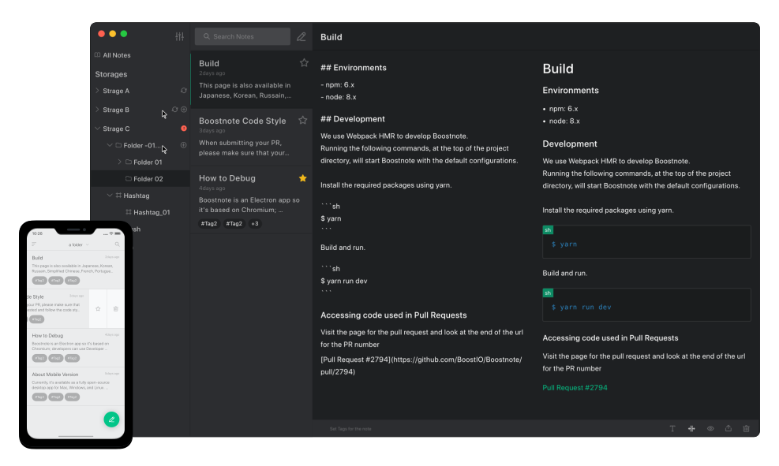
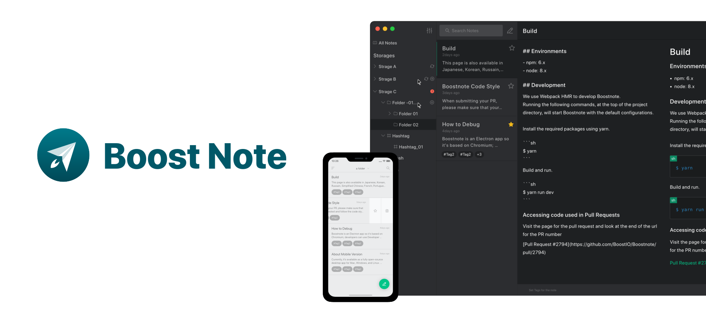

# 🚀 Boost Note Materials

[Boost Note](https://github.com/boostio/Boostnote.next) is a Polished Notes App with Github Flavored Markdown.

Feel free to use images on your blog :D

## 1. Logo(svg)

---

## 2. Logo(png)

---

## 3. Logo with text

---

## 4. App UI

---

## 5. App with logo

